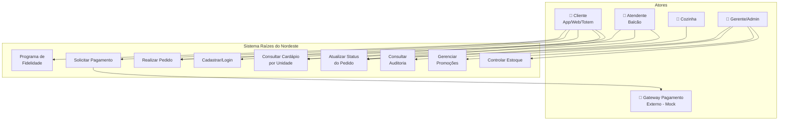
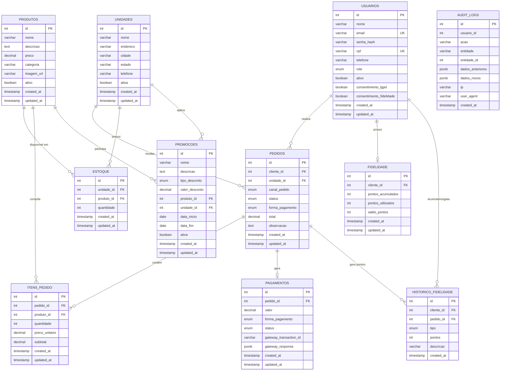
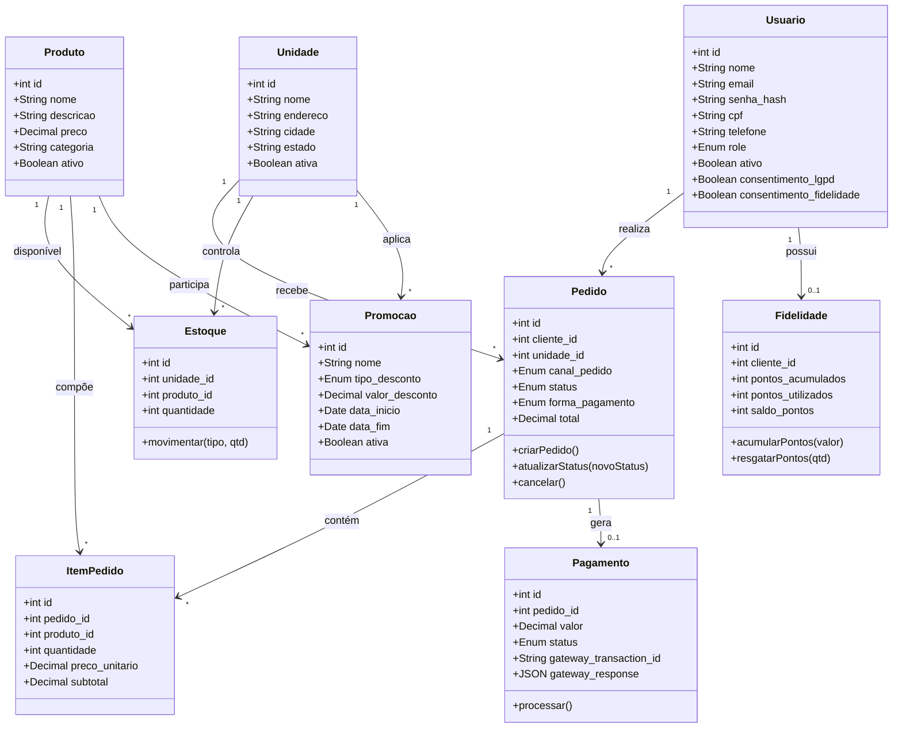
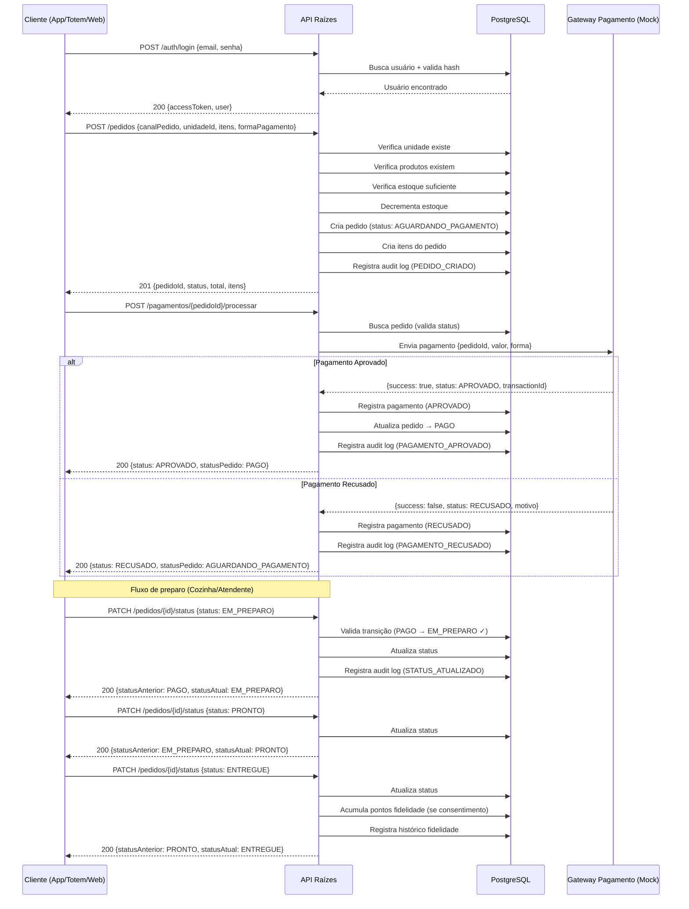
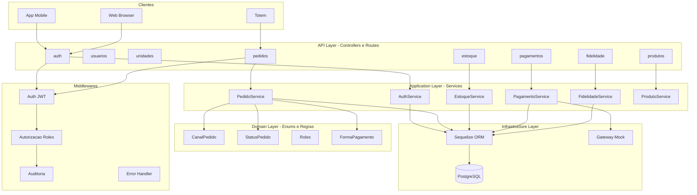

# Diagramas — Raízes do Nordeste

## 1. Diagrama de Casos de Uso

---

## 2. DER (Diagrama Entidade-Relacionamento)

---

## 3. Diagrama de Classes (Domínio)

---

## 4. Diagrama de Sequência — Fluxo Crítico (Pedido → Pagamento → Status)

---

## 5. Diagrama de Arquitetura (Camadas)

